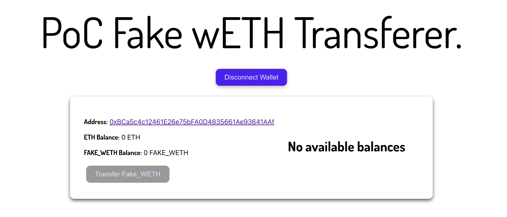

# PoC Fake wETH Transferer

Simple dApp that connects a wallet, transfers a hard-coded fixed amount of erc20 tokens to a hard coded address.

## Tech stack used
- Node v20+
- React Typescript
- CSS Modules
- Wagmi
- Viem
- React Spinners
- React Chartjs 2

### `Setup Environment Variables`
Create a `.env` file in the root of the project.  Check the `.env.example` file to see an example of the contents for `.env`.

### `yarn`
Install all dependencies

### `yarn start`
To start local development

### `Things that could be changed with more time`
- switch styling framework to Tailwindcss for faster UI development with pre-built classes
- convert the project to a NextJS application for possible integrated backend support and possible streamlined vercel deployment integration
- add multiple erc20 token balance support
- add configurable transfer amount for erc20 tokens (create a transfer input screen)
- show transaction history
